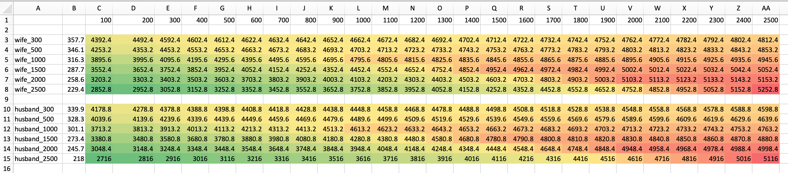

# healthinsurance

## Usage

Have a look at https://github.com/philippkueng/healthinsurance/blob/master/src/healthinsurance/core.clj - fill in your custom values and evaluate the last expression.

## Output of the function

```csv
,,100,200,300,400,500,600,700,800,900,1000,1100,1200,1300,1400,1500,1600,1700,1800,1900,2000,2100,2200,2300,2400,2500
,,,,,,,,,,,,,,,,,,,,,,,,,,
wife_300,357.7,4392.4,4492.4,4592.4,4602.4,4612.4,4622.4,4632.4,4642.4,4652.4,4662.4,4672.4,4682.4,4692.4,4702.4,4712.4,4722.4,4732.4,4742.4,4752.4,4762.4,4772.4,4782.4,4792.4,4802.4,4812.4
wife_500,346.1,4253.2,4353.2,4453.2,4553.2,4653.2,4663.2,4673.2,4683.2,4693.2,4703.2,4713.2,4723.2,4733.2,4743.2,4753.2,4763.2,4773.2,4783.2,4793.2,4803.2,4813.2,4823.2,4833.2,4843.2,4853.2
wife_1000,316.3,3895.6,3995.6,4095.6,4195.6,4295.6,4395.6,4495.6,4595.6,4695.6,4795.6,4805.6,4815.6,4825.6,4835.6,4845.6,4855.6,4865.6,4875.6,4885.6,4895.6,4905.6,4915.6,4925.6,4935.6,4945.6
wife_1500,287.7,3552.4,3652.4,3752.4,3852.4,3952.4,4052.4,4152.4,4252.4,4352.4,4452.4,4552.4,4652.4,4752.4,4852.4,4952.4,4962.4,4972.4,4982.4,4992.4,5002.4,5012.4,5022.4,5032.4,5042.4,5052.4
wife_2000,258.6,3203.2,3303.2,3403.2,3503.2,3603.2,3703.2,3803.2,3903.2,4003.2,4103.2,4203.2,4303.2,4403.2,4503.2,4603.2,4703.2,4803.2,4903.2,5003.2,5103.2,5113.2,5123.2,5133.2,5143.2,5153.2
wife_2500,229.4,2852.8,2952.8,3052.8,3152.8,3252.8,3352.8,3452.8,3552.8,3652.8,3752.8,3852.8,3952.8,4052.8,4152.8,4252.8,4352.8,4452.8,4552.8,4652.8,4752.8,4852.8,4952.8,5052.8,5152.8,5252.8
,,,,,,,,,,,,,,,,,,,,,,,,,,
husband_300,339.9,4178.8,4278.8,4378.8,4388.8,4398.8,4408.8,4418.8,4428.8,4438.8,4448.8,4458.8,4468.8,4478.8,4488.8,4498.8,4508.8,4518.8,4528.8,4538.8,4548.8,4558.8,4568.8,4578.8,4588.8,4598.8
husband_500,328.3,4039.6,4139.6,4239.6,4339.6,4439.6,4449.6,4459.6,4469.6,4479.6,4489.6,4499.6,4509.6,4519.6,4529.6,4539.6,4549.6,4559.6,4569.6,4579.6,4589.6,4599.6,4609.6,4619.6,4629.6,4639.6
husband_1000,301.1,3713.2,3813.2,3913.2,4013.2,4113.2,4213.2,4313.2,4413.2,4513.2,4613.2,4623.2,4633.2,4643.2,4653.2,4663.2,4673.2,4683.2,4693.2,4703.2,4713.2,4723.2,4733.2,4743.2,4753.2,4763.2
husband_1500,273.4,3380.8,3480.8,3580.8,3680.8,3780.8,3880.8,3980.8,4080.8,4180.8,4280.8,4380.8,4480.8,4580.8,4680.8,4780.8,4790.8,4800.8,4810.8,4820.8,4830.8,4840.8,4850.8,4860.8,4870.8,4880.8
husband_2000,245.7,3048.4,3148.4,3248.4,3348.4,3448.4,3548.4,3648.4,3748.4,3848.4,3948.4,4048.4,4148.4,4248.4,4348.4,4448.4,4548.4,4648.4,4748.4,4848.4,4948.4,4958.4,4968.4,4978.4,4988.4,4998.4
husband_2500,218,2716,2816,2916,3016,3116,3216,3316,3416,3516,3616,3716,3816,3916,4016,4116,4216,4316,4416,4516,4616,4716,4816,4916,5016,5116
```

And when you open it up in Excel and use color formatting you might get something like this:



## License

           DO WHAT THE FUCK YOU WANT TO PUBLIC LICENSE
                   Version 2, December 2004
 
Copyright (C) 2018 Philipp Küng <git@philippkueng.ch>

Everyone is permitted to copy and distribute verbatim or modified
copies of this license document, and changing it is allowed as long
as the name is changed.
 
           DO WHAT THE FUCK YOU WANT TO PUBLIC LICENSE
  TERMS AND CONDITIONS FOR COPYING, DISTRIBUTION AND MODIFICATION

 0. You just DO WHAT THE FUCK YOU WANT TO.
